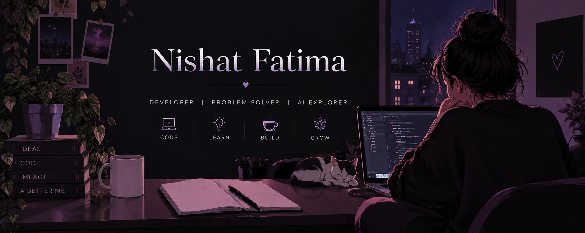
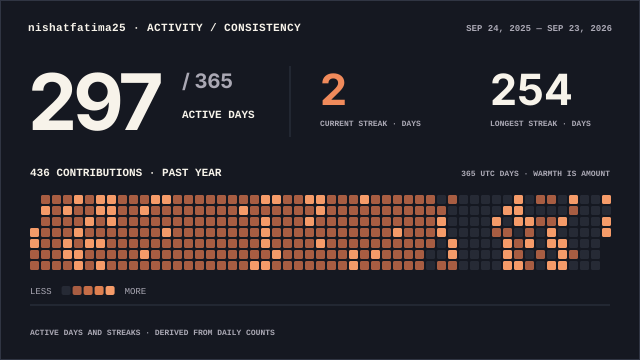

  

 

## ✦ About me

I'm a Computer Science student interested in **development, problem solving, and AI**.

I enjoy working on projects, learning new technologies, and improving my skills through practice.

Still learning, still building.

---

## ✦ Coding & workspace

  
  &nbsp;&nbsp;&nbsp;
  

---

## ✦ Tech Stack

  

---

## ✦ Analytics

  
  

  <picture>
    <source
      media="(prefers-color-scheme: dark)"
      srcset="./profile/activity-consistency-wide-dark.svg"
    />
    <source
      media="(prefers-color-scheme: light)"
      srcset="./profile/activity-consistency-wide-light.svg"
    />
    
  </picture>

`1000+ problems solved` · `CodeChef 3★` · `consistent coding`

---

## ✦ Connect With Me

[LinkedIn](https://www.linkedin.com/in/nishat-fatima-6ba8b7296) ·
[LeetCode](https://leetcode.com/u/Nishat_Fatima25/) ·
[CodeChef](https://www.codechef.com/users/YOUR_CODECHEF_USERNAME) ·
[Email](mailto:nishatfatima256@gmail.com)

