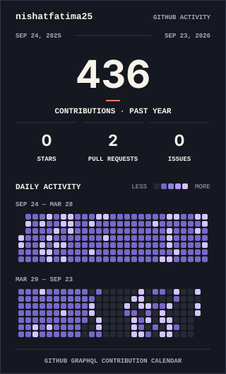
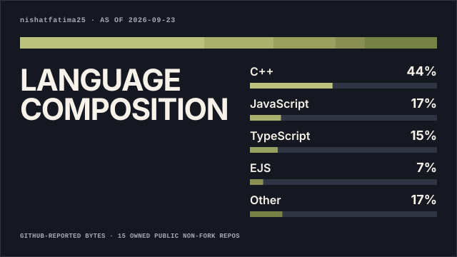

  

 

## ✦ About me

I'm a Computer Science student interested in **development, problem solving, and AI**.

I enjoy working on projects, learning new technologies, and improving my skills through practice.

Still learning, still building.

---

## ✦ Coding & workspace

  
  &nbsp;
  
  &nbsp;
  
  &nbsp;
  

---

## ✦ Tech Stack

  

---

## ✦ Analytics

  <picture>
    <source
      media="(prefers-color-scheme: dark)"
      srcset="./profile/activity-consistency-wide-dark.svg"
    />
    <source
      media="(prefers-color-scheme: light)"
      srcset="./profile/activity-consistency-wide-light.svg"
    />
    
  </picture>

  <picture>
    <source
      media="(prefers-color-scheme: dark)"
      srcset="./profile/signal-field-compact-dark.svg"
    />
    <source
      media="(prefers-color-scheme: light)"
      srcset="./profile/signal-field-compact-light.svg"
    />
    
  </picture>

  &nbsp;&nbsp;

  <picture>
    <source
      media="(prefers-color-scheme: dark)"
      srcset="./profile/language-composition-wide-dark.svg"
    />
    <source
      media="(prefers-color-scheme: light)"
      srcset="./profile/language-composition-wide-light.svg"
    />
    
  </picture>

---

## ✦ Connect With Me

  
  &nbsp;&nbsp;
  
  &nbsp;&nbsp;
  
  &nbsp;&nbsp;
  

